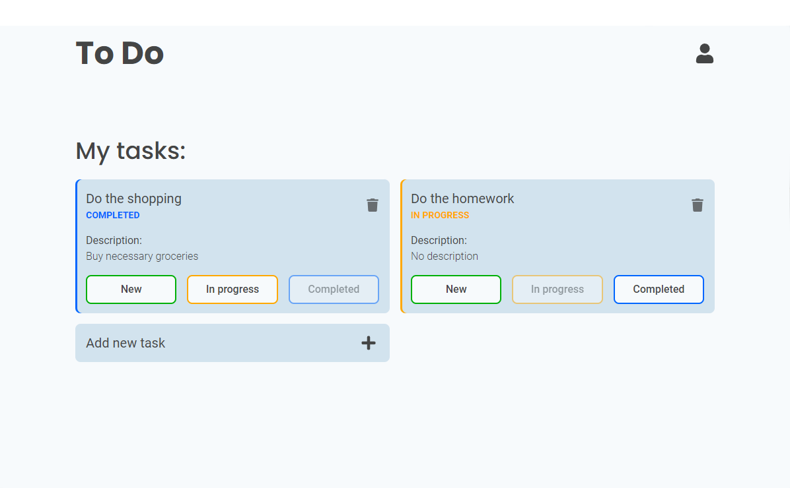

ToDo App
===

Simple ToDo application powered by React, Fastify and MongoDB.


## Features
- Tracks tasks and their status
- Responsive design
- Supports multiple users with JWT authentication
- Unit / Integration tests for frontend components
- Built with: React, Fastify, TypeScript and MongoDB
- Dockerized

## Usage
To run this application, you will need:
- NodeJS with yarn or npm
- Docker with docker-compose 

```bash
# Clone this repository
$ git clone https://github.com/mstopin/todo-app

# Open the project directory
$ cd todo-app

# Install dependencies
$ yarn install
# Or
$ npm install

# Go to env directory, copy *.example.env files, name them accordingly and type in empty secrets
# For development: backend.dev.env frontend.dev.env database.dev.env
# For production: backend.prod.env frontend.prod.env database.prod.env

# Run the app [development]
$ docker-compose -f docker-compose.dev.yaml up
# Run the app [production]
$ docker-compose -f docker-compose.prod.yaml up
```

## License
MIT