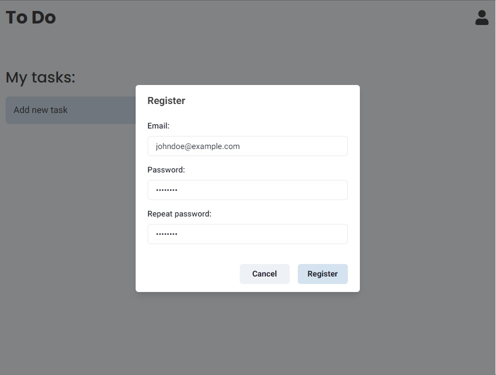
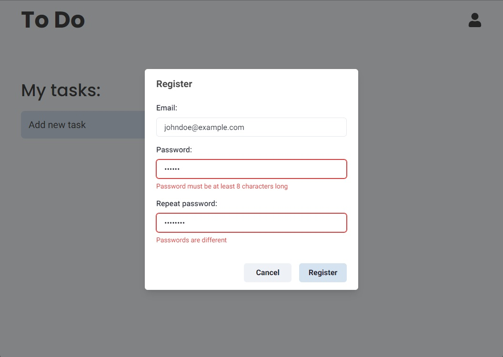
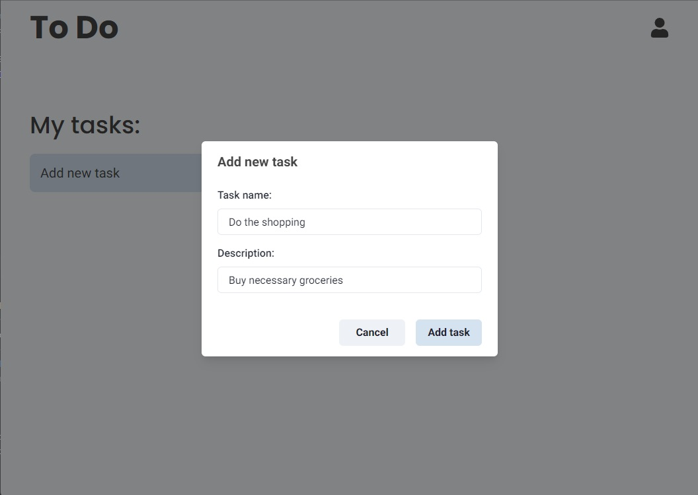
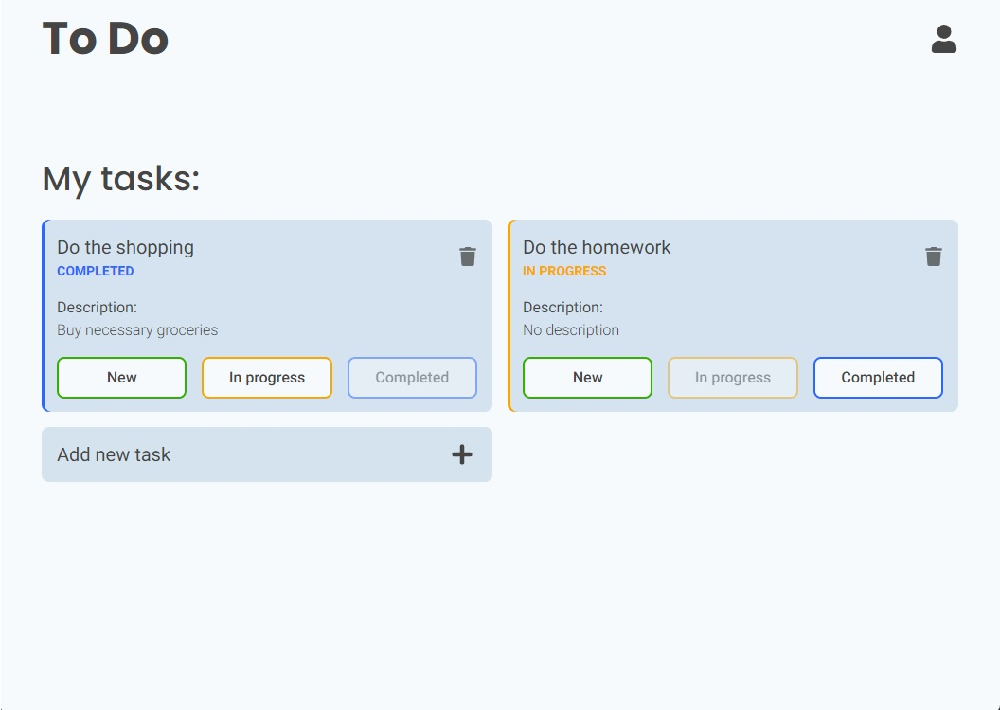

# TODO App

Simple TODO application powered by React, Fastify and MongoDB.  
Create account and manage your tasks on any device.

# Features

- Sign-Up / Log-In
- Manage your tasks on any device
- Responsive design
- Unit-tested frontend
- Uses Nginx as a reverse-proxy
- Dockerized and ready to deploy using docker-compose

# Stack

### Frontend

- TypeScript
- React
- NextJS
- SWR
- Chakra-UI

### Backend

- TypeScript
- Fastify
- JWT
- MongoDB

# Demo

## Sign-up



## Sign-up with validation errors



## Add task



## Tasks



# Usage

To run this application, you will need:

- NodeJS with yarn or npm
- Docker with docker-compose

```bash
# Clone this repository
$ git clone https://github.com/mstopin/todo-app

# Open the project directory
$ cd todo-app

# Install dependencies
$ yarn install
# Or
$ npm install

# Go to env directory, copy *.example.env files, name them accordingly and type in empty secrets
# For development: backend.dev.env frontend.dev.env database.dev.env
# For production: backend.prod.env frontend.prod.env database.prod.env

# Run the app [development]
$ docker-compose -f docker-compose.dev.yaml up
# Run the app [production]
$ docker-compose -f docker-compose.prod.yaml up
```

## License

MIT
